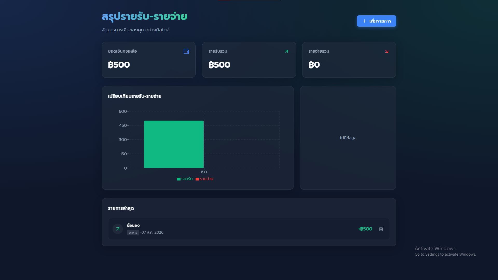

# 💰 ระบบสรุปรายรับ-รายจ่าย (Expense Tracker Dashboard)



ระบบจัดการและสรุปรายรับ-รายจ่ายแบบ Full-stack ที่ทันสมัย พัฒนาด้วย **Next.js**, **React** และ **Supabase** โปรเจคนี้โดดเด่นด้วยการนำเสนอข้อมูลผ่านกราฟที่สวยงาม (Data Visualization) ดีไซน์หน้าเว็บแบบ Dark Mode สไตล์ Glassmorphism และระบบฐานข้อมูลที่ใช้งานได้จริงแบบ Real-time

## ✨ ฟีเจอร์หลัก

- **หน้าสรุปข้อมูล (Dashboard):** แสดงยอดเงินคงเหลือ รายรับรวม และรายจ่ายรวม ได้อย่างรวดเร็ว
- **การนำเสนอข้อมูลด้วยกราฟ (Data Visualization):**
  - **กราฟแท่ง (Bar Chart):** เปรียบเทียบรายรับและรายจ่ายในแต่ละเดือน
  - **กราฟวงกลม (Donut Chart):** วิเคราะห์สัดส่วนรายจ่ายตามหมวดหมู่
- **ประวัติการทำรายการ (Transaction History):** ดูรายการล่าสุดพร้อมรูปแบบที่อ่านง่าย สบายตา
- **ระบบ Full-stack CRUD:** สามารถเพิ่มและลบรายการได้ โดยข้อมูลจะถูกบันทึกลงฐานข้อมูล PostgreSQL โดยตรง
- **Premium UI/UX:** ตกแต่งหน้าเว็บด้วย Vanilla CSS แบบเพียวๆ พร้อมรองรับ CSS Variables, เอฟเฟกต์กระจก (Glassmorphism), อนิเมชันย่อยๆ (Micro-animations) และรองรับการแสดงผลทุกหน้าจอ (Responsive)
- **รองรับภาษาไทย:** ข้อความและการแสดงผลวันที่ถูกปรับแต่งให้เหมาะสำหรับผู้ใช้งานชาวไทยโดยเฉพาะ

## 🚀 เทคโนโลยีที่ใช้ (Tech Stack)

- **Frontend:** Next.js (App Router), React 18
- **Backend/Database:** Supabase (PostgreSQL)
- **Styling:** Vanilla CSS (ไม่พึ่งพา Framework ภายนอก โหลดไวและเบามาก)
- **Data Visualization:** Recharts
- **Icons:** Lucide React
- **Date Formatting:** date-fns

## 🛠️ วิธีการติดตั้งและรันโปรเจค

### สิ่งที่ต้องมี
ตรวจสอบให้แน่ใจว่าเครื่องของคุณติดตั้ง [Node.js](https://nodejs.org/) แล้ว และคุณจำเป็นต้องมีบัญชีของ [Supabase](https://supabase.com/) สำหรับจัดการฐานข้อมูล

### 1. โคลนโปรเจค
```bash
git clone https://github.com/Phumrapeekub/Expense-Tracker-Dashboard.git
cd Expense-Tracker-Dashboard
```

### 2. ติดตั้งแพ็กเกจที่จำเป็น
```bash
npm install
```

### 3. ตั้งค่า Supabase (ฐานข้อมูล)
1. สร้างโปรเจคใหม่ใน [Supabase](https://supabase.com/)
2. ไปที่เมนู **SQL Editor** ในหน้า Dashboard ของ Supabase
3. ก๊อปปี้คำสั่ง SQL ในไฟล์ `supabase/schema.sql` ไปรันเพื่อสร้างตาราง `transactions`
4. เปลี่ยนชื่อไฟล์ `.env.local.example` เป็น `.env.local` (หรือสร้างไฟล์ใหม่) ในโฟลเดอร์หลักของโปรเจค และกรอกข้อมูลดังนี้:

```env
NEXT_PUBLIC_SUPABASE_URL=ลิงก์_โปรเจค_Supabase_ของคุณ
NEXT_PUBLIC_SUPABASE_ANON_KEY=Key_ของ_Supabase_ของคุณ
```

### 4. รันเซิร์ฟเวอร์จำลอง
```bash
npm run dev
```
เปิดเบราว์เซอร์ไปที่ [http://localhost:3000](http://localhost:3000) เพื่อดูผลลัพธ์ได้เลยครับ

## 📁 โครงสร้างโฟลเดอร์

```
├── app/                  # ส่วนควบคุมหน้าเพจและเลย์เอาต์ (Next.js App Router)
├── components/           # ส่วนประกอบของหน้าเว็บ (กราฟ, กล่องข้อความ, การ์ดต่างๆ)
├── lib/                  # ฟังก์ชันตัวช่วย (การเชื่อมต่อ Supabase)
├── supabase/             # โค้ดสร้างฐานข้อมูล (SQL schema)
└── public/               # รูปภาพและไฟล์คงที่ต่างๆ
```

## 📝 ไลเซนส์ (License)
โปรเจคนี้เป็น Open-source สามารถนำไปศึกษาและต่อยอดได้ตามเงื่อนไขของ [MIT License](LICENSE)
